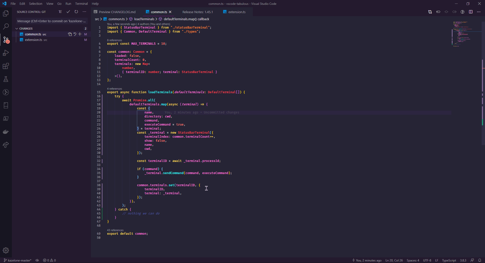

# Tabulous



Adds tabs for each terminal process to the status bar. It works by registering toggleable status bar buttons when terminals are created via the commands below. This extension started its life as [terminal-tabs](https://github.com/Tyriar/vscode-terminal-tabs).

Settings that can be keybound in your [keybindings.json](hsttps://code.visualstudio.com/docs/customization/keybindings#_customizing-shortcuts) file:

- `tabulous.createTerminal`: Creates a terminal with an icon
- `tabulous.createNamedTerminal`: Creates a terminal with an icon that has a name (indicated in the dropdown)
- `tabulous.renameTerminal`: Rename the active terminal. Replaces the built in terminal rename command
- `tabulous.reloadDefaultTerminals`: Disposes of all the currently open terminals and reloads your default terminals set within your config. Good for reloading the defaults when they've been changed, without having to close and reopen VS Code
- `tabulous.showTerminal1`: Shows the first terminal
- `tabulous.showTerminal2`: Shows the second terminal
- `tabulous.showTerminal3`: Shows the third terminal
- `tabulous.showTerminal4`: Shows the fourth terminal
- `tabulous.showTerminal5`: Shows the fifth terminal
- `tabulous.showTerminal6`: Shows the sixth terminal
- `tabulous.showTerminal7`: Shows the seventh terminal
- `tabulous.showTerminal8`: Shows the eighth terminal
- `tabulous.showTerminal9`: Shows the ninth terminal
- `tabulous.showTerminal10`: Shows the tenth terminal

## Available Settings

This extension provides the following settings:

- `tabulous.activeTabColor`: The colour of the active tab. This **must** be a valid css colour
- `tabulous.touchBar`: Enable touch bar support (macOS only).
  - **Default:** true
- `tabulous.createNamedTerminalTouchBarButton`: Enable Create Named Terminal touch bar button.
  - **Default:** true
- `tabulous.renameTerminalTouchBarButton`: Enable Rename Terminal touch bar button.
  - **Default:** true
- `tabulous.reloadDefaultTerminalsTouchBarButton`: Enable Rename Default Terminals touch bar button.
  - **Default:** true
- `tabulous.defaultTerminals`: Default terminal settings for automatically opening terminals when VS Code opens. Best used inside .code-workspace settings

`tabulous.defaultTerminals` example:

```jsonc
{
    "folders": [
        {
            "path": "relative/to/workspace/file",
            "name": "Named Workspace",
        },
        {
            "path": "relative/to/workspace/file",
            "name": "Another Named Workspace",
        },
    ],
    "tabulous.defaultTerminals": [{
        "name": "App",
        // Could be absolute path
        "directory": "C:/absolute/path",
        "command": "npm start",
        "executeCommand": false
    }, {
        "name": "API",
        // Could be the name of the workspace folder specified within the .code-workspace
        "directory": "Workspace Folder Name",
        "command": "npm start"
    }, {
        "name": "Watcher",
        // Could be relative path. If multi-root workspace,
        // path will be relative to the .code-workspace directory, otherwise
        // it will be relative to the workspace directory
        "directory": "./relative/path",
        "command": "npm run watch",
        "executeCommand": false
    }]
}
```
